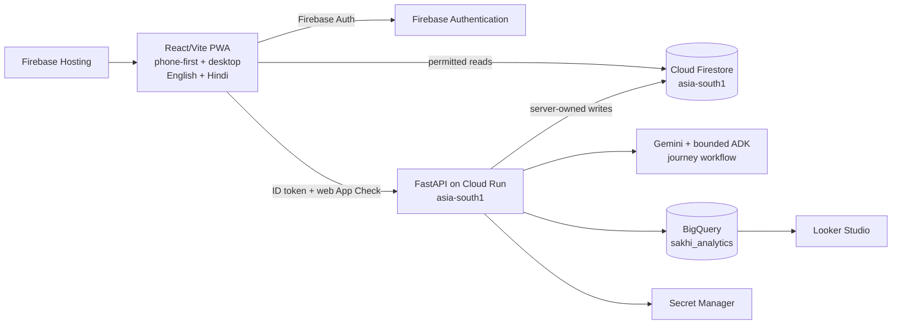

# SakhiCircle Website/PWA Architecture Review — Gate G2

Status: **APPROVED — website-first direction confirmed 2026-08-21**  
Scope: Patchamomma build-phase vertical slice; feature-specific schemas keep their later approval gates.

The previously approved Android-only architecture is superseded for active product work. Its source and evidence remain frozen under `apps/mobile` and `docs/validation/evidence/native`.

## Current system

Local development replaces cloud adapters with deterministic fakes and Firebase Auth/Firestore/Hosting emulators. The same browser UI and API contracts are used locally and after deployment.

## Approved decisions

### A1 — Client, repository, and delivery

- `apps/web` is the primary product client using React, TypeScript, Vite, and PWA support.
- `apps/mobile` is frozen historical Android work; it is neither extended nor deleted without explicit approval.
- Firebase Hosting is the primary client deployment target; Netlify is fallback-only.
- `services/api` remains a single FastAPI service deployed to Cloud Run with minimum instances `0` and maximum `2`.
- The browser experience is mobile-first at 360×800 and remains coherent on desktop.

Why: one browser build can run locally, on a phone over LAN, and through a shareable judging URL without APK installation or emulator dependencies.

### A2 — Authentication and trust boundary

- Firebase Authentication web SDK provides passwordless email and Google sign-in when configured.
- A deterministic demo session is available only in explicit development/demo mode.
- Protected API requests carry a Firebase ID token and production App Check token.
- Firestore rules deny by default; protected state remains server-write-only.
- No Gemini key, service-account credential, transcript, or secret is bundled into the PWA.

Why: configuration is explicit, local work remains deterministic, and production never falls back to demo credentials.

### A3 — Voice and journey intelligence

- The PWA always offers text input; browser microphone input is an accelerator, never the only path.
- The learner reviews and edits a transcript and extracted fields before persistence.
- Raw audio is never stored.
- Deterministic journey fixtures are implemented and tested before real Gemini calls.
- The only checkpoint ADK workflow is plan generator → safety/accessibility reviewer → English/Hindi localizer.

Why: the strongest demonstration remains usable if microphone permission or an external AI call fails.

### A4 — Data and analytics

- Firestore stores confirmed operational profiles, journeys, and permitted recommendation data.
- Synthetic checkpoint data contains 250 profiles, 40 mentors, 15 hobbies, 25 future circles, and 90 days of events.
- Matching filters and scores are deterministic; AI may translate explanations but cannot change rankings.
- FastAPI emits allowlisted pseudonymous events to partitioned BigQuery tables.
- Looker Studio shows a small proof covering journey and recommendation outcomes.

Why: the project is demonstrably data-driven without using confidential or real participant data.

### A5 — Scope, quality, and cost

- The August 28 vertical slice is sign-in → learning wish → editable four-week journey → explainable match → analytics proof.
- Payments, full circles/chat, mentor marketplace operations, native distribution, and additional agents are deferred.
- Tests use Vitest/React Testing Library, Playwright, axe, pytest, Firebase emulators, and deterministic adapters.
- Budget alerts remain at USD 10, 25, and 40; rate limits and Cloud Run instance caps bound external use.
- A local fallback and backup demonstration video are required before submission lock.

Why: a narrow, complete journey is more credible than many partially connected features before the September 7 deadline.

## Validation gates

| Gate | Required evidence |
|---|---|
| Local | One command starts the website, API, emulators/fakes and synthetic seed |
| Responsive | 360×800, desktop alignment, 200% zoom, keyboard and screen-reader smoke evidence |
| Cloud | Firebase Hosting URL and Cloud Run `/health` response |
| Intelligence | Deterministic fallback and one schema-valid Gemini journey case |
| Data | Explainable synthetic match plus one idempotent BigQuery event/dashboard proof |

## Approval record

The user explicitly directed the form-submitted project to continue as a locally runnable, mobile-first website and asked for this platform and build-phase plan to replace the active Android documentation on 2026-08-21.
