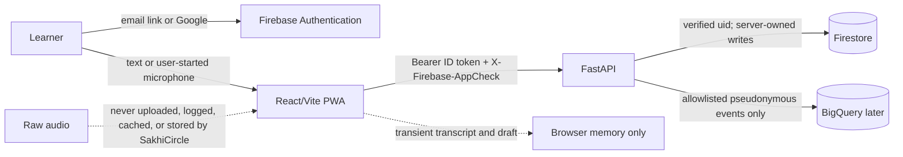

# Gate G4 — Authentication, Data, Voice, and Privacy Boundary

Status: **APPROVED — Gate G4 approved 2026-08-22**  
Scope: the website/PWA vertical slice only. Approval unlocks SC-210; it does not claim that every control below is implemented.

## Boundary at a glance

Firebase Authentication proves who the learner is. App Check separately attests that a protected production request came from the configured web application. Neither control replaces the other.

## G4 decisions

| Area | Approved implementation boundary | Failure boundary |
|---|---|---|
| Sign-in | Passwordless email and Google use the Firebase web SDK. Firebase alone manages the signed-in session. The app may temporarily keep the pending email address for completing an email link, then removes it after success, cancellation, or a failed/expired completion attempt. | Missing Firebase configuration shows an actionable sign-in error. Production never substitutes a demo identity. |
| ID token | Every protected API call sends the current Firebase ID token as `Authorization: Bearer <token>`; the Firebase SDK refreshes it when required. FastAPI verifies signature, issuer, audience/project, expiry, and revocation, then derives `uid` and trusted custom claims from the verified token. | A missing, expired, revoked, wrong-project, or invalid token returns `401` with no token detail in the response or logs. |
| App Check | Every protected production API call also sends `X-Firebase-AppCheck`. FastAPI verifies the token for the configured Firebase app. Public `/health` and `/ready` remain usable without it. | A missing or invalid production App Check token returns `403`. Bypass is allowed only in an explicit deterministic/test/emulator mode that cannot start as production. |
| Demo identity | `Continue as Meera` uses a synthetic learner only when explicit demo mode is enabled outside production. It may use deterministic local data but cannot write production Firestore or analytics. | Demo UI and demo-token acceptance are both absent in production. A copied demo token receives `401`. |
| Authorization | API access is scoped to the verified `uid`; roles come only from server-trusted claims. The browser cannot select a user id or elevate a role. Firestore and Storage stay deny-by-default; any later direct read requires an emulator-tested, least-privilege rule. Operational writes go through FastAPI. | Cross-user access, client-supplied roles, and untested direct collection access are denied. |
| Sign-out | Sign-out clears the Firebase session, pending email, unsaved transcript/draft, user-specific query state, and user-specific offline cache before returning to sign-in. | A cleanup failure keeps the app signed out and shows a retryable local-data cleanup notice; it never restores the old session silently. |

## Voice, transcript, and confirmation

1. Text input is always available. Microphone access starts only after a labelled user action, uses the browser permission prompt, and has a visible stop/cancel control.
2. SakhiCircle never uploads, stores, logs, caches, or adds raw audio to analytics. If the selected browser speech service processes audio outside the device, the UI must disclose that before permission; declining keeps the complete text path available.
3. The live transcript and extracted onboarding draft stay in browser memory before confirmation. They are cleared on cancel, sign-out, refresh, or completion of the confirmation step.
4. Confirmation saves only the reviewed structured fields: hobby, experience, goal, availability, language, accessibility need, format, consent, and optional city. The MVP does not persist the verbatim transcript.
5. No profile, journey request, recommendation event, or analytics event is written before explicit confirmation. Sensitive text is excluded from URLs, telemetry, exception reports, and request/response logging.

## Stored data and purpose

| Store | Permitted data | Explicitly forbidden |
|---|---|---|
| Firebase Authentication | Provider identity, verified email when supplied by the provider, display name, uid, trusted role claims | Learning transcript, raw audio, journey content, payment data |
| Firestore | Confirmed structured profile, confirmed journey, consent state, user-owned progress, permitted recommendation references | Raw audio, unconfirmed drafts, verbatim transcript, credentials, exact location, confidential work data |
| Browser | Firebase-managed session, temporary pending sign-in email, transient unconfirmed draft, read-only confirmed-journey cache | Raw-audio cache, secret keys, service-account material, cross-user cached data |
| API logs | Trace id, route template, status, latency, environment-safe error code | Tokens, headers, email, name, request/response bodies, transcript, raw text, city, raw audio |
| Analytics | Later G7 allowlist using pseudonymous identifiers and fixed categorical/numeric properties | Name, email, transcript, raw text, city/exact location, credentials, raw audio |

## Deletion boundary

| Trigger | Required result | Completion rule |
|---|---|---|
| Cancel before confirmation | Clear transcript and extracted draft from memory; write nothing | Immediate in the active browser session |
| Delete a saved journey/profile field | Authenticated API deletes or updates only records owned by the verified `uid`, then clears the matching browser cache | UI reports success only after the server confirms it |
| Delete account | Require a recent sign-in, revoke the Firebase session, delete user-owned Firestore data and queued writes, remove the Firebase Auth account, and clear local user data | Idempotent operation with visible pending/failed state; target completion within 24 hours |
| Analytics linked to the account | G7 must keep a server-resolvable deletion key without exposing the Firebase uid in dashboard data; deletion removes linkable row-level events | Target completion within 30 days; irreversibly aggregated, non-identifying totals may remain |
| Logs and managed recovery copies | Content-bearing personal data is forbidden from logs. Any future backup/export must declare its expiry and deletion behavior before activation | No silent backup or export is added under G4 |

Account deletion is fail-closed: partial deletion is recorded for retry and is never presented as complete. SakhiCircle must not ask the client to enumerate deletion targets or trust a client-supplied uid.

## Verification unlocked after approval

SC-210 must first add red tests for the token, App Check, demo, sign-out, and production fail-closed cases before implementation. SC-300 then presents the bilingual confirmation UX; SC-310 implements the transient transcript and no-write-before-confirmation boundary. Emulator tests must prove deny-by-default rules and cross-user rejection before any Firestore access is opened.

## Approval record

The user approved Gate G4 as written on 2026-08-22. SC-200 is `DONE`, and SC-210 is `READY`.
