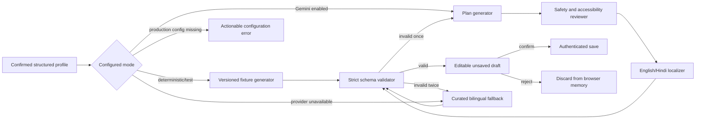

# Gate G5 — Versioned Journey and Fallback Contract

Status: **APPROVED — Gate G5 approved 2026-08-25**  
Scope: the website/PWA vertical slice. Approval unlocks SC-410; it does not implement journey generation or Gemini/ADK.

## Decision at a glance

SakhiCircle uses one strict `1.0.0` JSON shape for deterministic fixtures, Gemini/ADK output, and the curated fallback. Every draft contains exactly 28 consecutive dated activities, English and Hindi content, schedule limits derived from the learner's confirmed availability, an activity-specific accessible alternative, reflection prompt, and safety note.

Generation never saves a journey. The learner reviews and may edit or reject the draft first. Only an explicit confirmation sends the edited, schema-valid journey to the authenticated API for persistence.



## Versioned response schema

API field names use `camelCase`; server models use strict Pydantic validation with unknown fields forbidden. `schemaVersion` starts at `1.0.0`.

```json
{
  "schemaVersion": "1.0.0",
  "journeyId": "journey_opaque_id",
  "status": "draft",
  "startsOn": "2026-08-26",
  "timezone": "Asia/Kolkata",
  "languages": ["en", "hi"],
  "title": {
    "en": "Four weeks to restart watercolour painting",
    "hi": "वॉटरकलर पेंटिंग फिर शुरू करने के चार सप्ताह"
  },
  "summary": {
    "en": "A steady plan for making one greeting card.",
    "hi": "एक शुभकामना कार्ड बनाने की सहज योजना।"
  },
  "provenance": {
    "generator": "deterministic_fixture",
    "attempts": 0,
    "fallbackUsed": false,
    "fallbackReason": null
  },
  "review": {
    "status": "passed",
    "contractVersion": "safety-accessibility-v1",
    "passedChecks": ["schema", "schedule", "accessibility", "safety", "localization"]
  },
  "weeks": [
    {
      "weekNumber": 1,
      "theme": {
        "en": "Begin gently",
        "hi": "सहज शुरुआत"
      },
      "outcome": {
        "en": "Set up materials and practise simple washes.",
        "hi": "सामग्री तैयार करें और सरल वॉश का अभ्यास करें।"
      },
      "activities": [
        {
          "activityId": "day-01",
          "dayNumber": 1,
          "date": "2026-08-26",
          "kind": "practice",
          "required": true,
          "durationMinutes": 30,
          "title": {
            "en": "Make a colour wash",
            "hi": "रंग का वॉश बनाएँ"
          },
          "instructions": {
            "en": ["Place three colours and water within easy reach.", "Paint one light-to-dark strip with each colour."],
            "hi": ["तीन रंग और पानी अपनी आसान पहुँच में रखें।", "हर रंग से हल्के से गहरे रंग की एक पट्टी बनाएँ।"]
          },
          "accessibleAlternative": {
            "en": "Work seated at a table and use a clipboard or raised board.",
            "hi": "मेज़ पर बैठकर काम करें और क्लिपबोर्ड या ऊँचे बोर्ड का उपयोग करें।"
          },
          "reflectionPrompt": {
            "en": "Which colour felt easiest to control?",
            "hi": "कौन-सा रंग संभालना सबसे आसान लगा?"
          },
          "safetyNote": {
            "en": "Use non-toxic colours, keep water away from electrical items, and pause if uncomfortable.",
            "hi": "गैर-विषैले रंग इस्तेमाल करें, पानी को बिजली के सामान से दूर रखें और असहजता होने पर रुकें।"
          }
        }
      ]
    }
  ]
}
```

The example abbreviates the array only for readability. A valid document must satisfy all rules below.

## Locked field rules

| Field | Rule |
|---|---|
| `schemaVersion` | Exact supported semantic version. Breaking shape or meaning changes increment the major version; additive optional fields increment minor; wording-only fixture changes increment patch. |
| `journeyId` / `status` | Server-created opaque ID; generation returns `draft`. A confirmed record is server-owned and returns `confirmed`. |
| `startsOn` / `timezone` | ISO date in `Asia/Kolkata`; dates are consecutive from day 1 through day 28. |
| `languages` | Exactly `en` and `hi`. Every learner-visible string is present in both languages; learner-entered hobby/goal words remain verbatim inside reviewed bilingual framing. |
| `weeks` | Exactly four weeks numbered 1–4; each has exactly seven activities. |
| Activity identity | `dayNumber` is unique and consecutive 1–28; `activityId` is `day-01` through `day-28`; week and date must agree with the day number. |
| `kind` | One of `learn`, `practice`, `create`, `reflect`, or `rest`. A rest activity is optional and has `durationMinutes: 0`. |
| Schedule | Non-rest duration is 5–45 whole minutes and never exceeds the learner's confirmed per-day availability. Each week contains no more required non-rest activities than the confirmed days-per-week value; other days are clearly optional reflection or rest. |
| Text limits | Plain Unicode text only: no HTML, Markdown, URLs, executable content, or model/tool instructions. Titles are 1–120 characters; each language has 1–4 instruction steps of 1–280 characters; summaries, alternatives, prompts, and safety notes are bounded to 500 characters. |
| `provenance` | `generator` is `deterministic_fixture`, `gemini_adk`, or `curated_fallback`; attempts are 0–2. `fallbackReason` is a fixed safe code, never a provider message or model output. |
| `review` | Only `passed` documents reach the learner. Store fixed check names and contract version, never reviewer chain-of-thought. |

The response excludes uid, name, email, city, transcript, raw audio, credentials, prompts, model reasoning, and provider error details. Confirmed hobby, goal, experience, availability, language, accessibility, and format are the only profile inputs available to journey generation; consent flags and city are not sent to the model.

## Safety and accessibility reviewer contract

Each workflow attempt is bounded to this sequence:

1. The generator creates a complete English canonical plan from the confirmed allowlisted fields. Hobby and goal values are delimited as learner data, never interpreted as system or tool instructions.
2. The reviewer returns only `pass` or fixed rejection codes. It cannot call tools, browse, diagnose, prescribe treatment, add health claims, or broaden the learner's goal.
3. A pass requires a realistic availability budget, age-neutral and dignified language, a useful alternative for every activity, no assumption of frailty, activity-specific safety guidance, and no medical, therapeutic, dietary, financial, or hazardous instruction.
4. The localizer adds reviewed Hindi while preserving IDs, dates, order, kinds, required flags, durations, instruction-step count, and safety meaning. It may not invent activities or change difficulty.
5. The final deterministic validator checks the complete bilingual document. Any rejection or validation failure invalidates the whole attempt; partial model output is never spliced into a valid plan.

Deterministic fixtures and curated templates pass the same final validator. Curated templates are reviewed before release and carry the same `safety-accessibility-v1` contract marker.

## Retry and fallback contract

- A schema, schedule, reviewer, or localization failure triggers exactly one automatic retry of the complete workflow. Maximum external workflow attempts: two; maximum configured budget: 10 seconds per attempt and 20 seconds total.
- A configured provider becoming unavailable skips retry and immediately selects the curated fallback. Missing required production configuration fails closed with an actionable configuration error; it never silently selects a demo identity, deterministic adapter, or external integration. Automated tests and explicit deterministic mode make zero paid or external calls.
- The retry receives the same allowlisted confirmed fields plus fixed rejection codes only. It never receives raw reviewer reasoning, transcript, audio, identity, city, prior free-form provider errors, or secrets.
- If the second attempt fails, SakhiCircle discards both model drafts and validates a complete curated bilingual template. It never repairs model output by silently mixing it with fallback content.
- If the curated fallback itself fails local validation, the API returns `503` with code `journey_unavailable`; the UI preserves the confirmed profile, offers retry, and persists no journey.

Fallback provenance is explicit: `generator` is `curated_fallback`, `fallbackUsed` is `true`, and `fallbackReason` is one of `workflow_unavailable`, `workflow_timeout`, `validation_failed_twice`, `review_failed_twice`, or `localization_failed_twice`.

The learner sees the same calm notice for every fallback reason so internal failure details are not exposed:

- English: “We couldn't create a personalised plan just now. Here is a reviewed four-week plan you can use or edit.”
- Hindi: “अभी आपकी व्यक्तिगत योजना नहीं बन सकी। यहाँ चार सप्ताह की जाँची हुई योजना है, जिसे आप इस्तेमाल या संपादित कर सकती हैं।”

The curated plan uses four reviewed phases—gentle setup, foundation practice, a small goal-linked project, and finish/reflection. It fills only approved structured slots, respects the selected schedule and accessibility setting, includes both languages, makes no AI call, and remains editable or rejectable.

## Edit, reject, and persistence boundary

- `POST /api/v1/journeys` uses the authenticated learner's already-confirmed profile plus a validated `startsOn` date and returns an unsaved draft. It does not write a journey, provider payload, prompt, or content-bearing log.
- The client keeps the draft in memory. Interface-language switching changes which reviewed text is shown without regenerating or translating the plan.
- The learner may change the start date, duration within her confirmed limit, title, instructions, accessible alternative, and reflection prompt. The reviewed safety note remains visible and is not silently removed. An edited draft must pass the same structural and schedule validation before confirmation.
- Reject clears the draft from memory and writes nothing. Explicit confirmation sends the edited schema content to `PUT /api/v1/journeys/{journeyId}`; the API derives uid, confirmation time, and trusted record metadata rather than accepting them from the client.
- Only the confirmed record may be stored in Firestore and cached read-only for offline access. Unsupported schema majors fail closed with an actionable update message; they never downgrade silently.

## Verification unlocked after approval

SC-410 must add red tests before implementation for exact 28-day/date/week structure, bilingual required fields, availability limits, strict unknown-field rejection, deterministic provenance, fallback validation, no write before confirmation, edit/reject behavior, authentication, and forbidden transcript/audio/profile fields. Focused tests must pass before the complete web, browser, build, and API suites run.

SC-600 later connects the real Gemini/ADK workflow behind this identical contract and proves first-pass success, one invalid-output retry, reviewer rejection, timeout/unavailability fallback, no external calls in deterministic tests, and schema-valid English/Hindi output.

## Approval record

The user approved Gate G5 as written on 2026-08-25. SC-400 is `DONE`, and SC-410 is `READY`.
