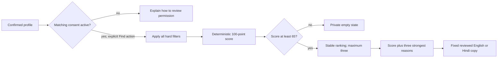

# Gate G6 — Explainable Matching and Synthetic Data Contract

Status: **APPROVED — Gate G6 approved 2026-08-26**  
Scope: the website/PWA vertical slice. Approval unlocks SC-510; this document does not implement recommendations or generate synthetic records.

## Decision at a glance

SakhiCircle matches only from deterministic, explicitly synthetic candidates. The authenticated learner must have a confirmed profile and active matching consent. The server applies every hard filter before scoring, returns at most three candidates scoring at least 65 out of 100, and gives exactly the three strongest score reasons for every returned candidate.

The August 28 judged path requests a learning-partner recommendation after journey confirmation. The same API contract accepts `type=mentor`, but production booking, payments, and mentor marketplace operations remain deferred.



## Request and response boundary

`GET /api/v1/recommendations?type=partner|mentor` is authenticated and read-only. It derives the learner from the verified token and reads the learner's already-confirmed profile server-side. It accepts no uid, hobby, goal, city, consent, candidate ID, score, or free text from the query.

The request is made only after a labelled learner action. Page load, journey generation, journey editing, language switching, and journey confirmation do not silently request a recommendation. SC-510 writes no recommendation decision or analytics event; those require separately approved contracts.

API field names use `camelCase`; server models use strict validation with unknown fields forbidden. `contractVersion` starts at `matching-v1.0.0`.

```json
{
  "contractVersion": "matching-v1.0.0",
  "recommendationType": "partner",
  "source": "deterministic_synthetic",
  "synthetic": true,
  "status": "matched",
  "scoreThreshold": 65,
  "resultLimit": 3,
  "results": [
    {
      "candidateId": "syn_partner_0042",
      "candidateType": "partner",
      "displayName": "Kavita R.",
      "synthetic": true,
      "score": 100,
      "scoreOutOf": 100,
      "hobby": {
        "en": "Watercolour painting",
        "hi": "वॉटरकलर पेंटिंग"
      },
      "reasons": [
        {
          "factor": "hobbyGoalFit",
          "reasonCode": "same_hobby_and_goal",
          "points": 30,
          "maxPoints": 30,
          "text": {
            "en": "You both want to restart watercolour and complete a small project.",
            "hi": "आप दोनों वॉटरकलर फिर शुरू करके एक छोटा प्रोजेक्ट पूरा करना चाहती हैं।"
          }
        },
        {
          "factor": "schedule",
          "reasonCode": "same_practice_rhythm",
          "points": 20,
          "maxPoints": 20,
          "text": {
            "en": "Your practice rhythms both suit 30 minutes, four days a week.",
            "hi": "आप दोनों के अभ्यास के लिए सप्ताह में चार दिन, 30 मिनट उपयुक्त हैं।"
          }
        },
        {
          "factor": "language",
          "reasonCode": "preferred_language_shared",
          "points": 15,
          "maxPoints": 15,
          "text": {
            "en": "You both prefer Hindi for learning.",
            "hi": "आप दोनों सीखने के लिए हिंदी पसंद करती हैं।"
          }
        }
      ],
      "factorBreakdown": [
        { "factor": "hobbyGoalFit", "points": 30, "maxPoints": 30 },
        { "factor": "schedule", "points": 20, "maxPoints": 20 },
        { "factor": "language", "points": 15, "maxPoints": 15 },
        { "factor": "skillLevel", "points": 15, "maxPoints": 15 },
        { "factor": "pace", "points": 10, "maxPoints": 10 },
        { "factor": "format", "points": 10, "maxPoints": 10 },
        { "factor": "price", "points": 0, "maxPoints": 0 }
      ]
    }
  ]
}
```

`score` must equal the integer sum of `factorBreakdown.points`. The example is illustrative; the deterministic fixture may have a different score. A normal empty result returns `200`, `status: "no_matches"`, an empty `results` array, and only `emptyReason: "no_eligible_candidate"` or `"hobby_not_in_catalog"`. It never identifies a filtered candidate or reveals which private filter removed someone.

## Canonical matching inputs

The matcher uses only normalized categorical values derived from the confirmed profile and synthetic candidate catalog. It never passes learner text to an AI model.

| Input | Canonical values and rule |
|---|---|
| Hobby | One of 15 versioned hobby IDs. Reviewed English/Hindi aliases map deterministically; an unknown hobby produces `hobby_not_in_catalog` rather than a guessed category. |
| Goal | `restart_basics`, `complete_small_project`, `build_routine`, `learn_with_peers`, or `prepare_to_teach`. Reviewed aliases may assign one tag; no recognized tag means hobby-only scoring. |
| Experience | `new` = 0, `returning` = 1, `recent` = 2. The approved English and Hindi onboarding values map to the same level. |
| Availability | `gentle` = 15 minutes/3 days, `steady` = 30 minutes/4 days, or `immersive` = 45 minutes/5 days. This checkpoint compares practice capacity, not uncollected clock-time availability. |
| Language | `en`, `hi`, or the set `{en, hi}`. |
| Pace | Derived from the three approved availability tiers: `gentle`, `steady`, or `immersive`. |
| Format | `home_individual`, `home_online_group`, or `in_person_group`. Mentors may support more than one format and declare one primary format. |
| City | A normalized synthetic city code used only to make an in-person format compatible. It is neither scored nor returned. Missing city makes an in-person candidate incompatible. |
| Accessibility | Never filters, scores, ranks, or appears in a match explanation. It remains available only to the learner's journey experience. |
| Price | Weight is `0` in `matching-v1.0.0` because real payment and learner-budget collection are deferred. Activating price requires a new approved contract version and explicit budget input. |

The 15 checkpoint hobby IDs are `watercolour`, `drawing`, `embroidery`, `knitting`, `crochet`, `sewing`, `classical_singing`, `folk_singing`, `harmonium`, `gardening`, `baking`, `regional_cooking`, `photography`, `creative_writing`, and `spoken_english`. Each has fixed reviewed English and Hindi labels and aliases.

## Hard filters

The server checks request preconditions first: valid authentication, a confirmed profile, active `matchingConsent`, a supported `type`, and a recognized hobby. It then removes a candidate if any applicable rule fails:

1. **Active and consented:** a partner has active matching consent; a mentor has an active listing consent, `verified` status, and a published listing. Every candidate and relation record is explicitly synthetic and belongs to the selected dataset version.
2. **Compatible hobby and language:** the candidate has the same canonical hobby ID and at least one language in common with the learner.
3. **Overlapping capacity:** both sides can sustain at least one shared 15-minute practice/session in a week. This is deliberately labelled practice-capacity overlap; the UI must not claim that uncollected days or clock times are the same.
4. **Compatible format:** the learner's selected format must equal the partner's format or be in the mentor's supported formats. `in_person_group` additionally requires the same non-empty normalized city code.
5. **No safety or preference exclusion:** a block or active previous rejection in either direction removes the candidate before scoring. The candidate is also excluded if it resolves to the requesting learner.

Hard-filter failures contribute no partial points. Filtered candidates, filter counts, block direction, rejection details, and candidate consent state never leave the server.

## Locked score weights and rules

Only candidates passing every hard filter are scored. All contributions are non-negative integers and sum to 100 possible points.

| Factor | Weight | Deterministic contribution |
|---|---:|---|
| Hobby and goal fit | 30 | 15 for the already-compatible exact hobby; plus 15 for the same recognized goal tag. No recognized goal tag receives no guessed goal points. |
| Schedule | 20 | Duration: 10 exact tier, 7 one tier apart, 4 two tiers apart. Weekly frequency: 10 exact day count, 7 one day apart, 4 two days apart. |
| Language | 15 | A one-language preference receives 15 when shared. A bilingual preference receives 15 from a bilingual candidate or 8 from a candidate sharing one requested language. |
| Skill level | 15 | Partner: 15 for the same level, 10 one level apart, 5 two levels apart. Mentor: 15 when the learner's level is explicitly taught, 8 for an adjacent taught level, otherwise 0. |
| Pace | 10 | 10 for the same tier, 6 one tier apart, 2 two tiers apart. |
| Format | 10 | Partner: 10 for the exact selected format. Mentor: 10 when it is the mentor's primary format or 6 when it is a supported secondary format. |
| Price | 0 | Not applicable in this contract version; always 0/0 and never shown as a reason. |

Candidates below 65 are discarded. Remaining candidates sort by total score descending, then hobby/goal points descending, schedule points descending, language points descending, and finally opaque `candidateId` ascending. The comparator is the only ranking authority: array order, synthetic generation order, popularity, engagement, age, name, city, accessibility, and translated wording never break a tie.

The endpoint returns at most three results. The deterministic judged fixture is designed to leave one eligible top result, so SC-510 can present one calm recommendation without a marketplace-style grid.

## Explanation contract

Every returned candidate contains exactly three `reasons`, chosen from positive factor contributions after ranking. Reasons sort by awarded points descending, with ties resolved in this fixed order: hobby/goal, schedule, language, skill level, pace, format, price.

- Each reason carries its factor, fixed `reasonCode`, awarded/max points, and reviewed English/Hindi text. It uses catalog labels and fixed slots, never raw learner or candidate free text.
- The visible result shows “Match score: _n_ out of 100” / “मैच स्कोर: 100 में से _n_” and the three reasons immediately below it. The score is not a guarantee, popularity measure, or assessment of either woman.
- A “How matching works” disclosure explains the 65-point threshold, hard filters, and seven-factor weight table in plain language. It does not list failed candidates or private exclusions.
- Interface-language switching selects the already-returned reviewed copy. It makes no new API call and cannot change candidate IDs, factor points, score, order, or reason selection.
- Gemini is not used in SC-510. A later localizer may translate only approved message keys and catalog slots after ranking, and a deterministic validator must prove all IDs, values, and order are unchanged.

The UI keeps the existing Olive Cream system: one primary result surface, no nested card grid, 18px-equivalent body copy, 48px targets, visible focus, and no color-only meaning. Loading uses an inline labelled skeleton/status; success moves focus to the recommendation heading; retryable errors use an accessible alert; and score plus reasons remain readable at 320px and 200% zoom.

The success label is explicit:

- English: “Demo match — synthetic profile”
- Hindi: “डेमो मैच — काल्पनिक प्रोफ़ाइल”

The no-match copy protects candidate privacy:

- English: “We couldn't find a compatible demo match yet. Your learning plan is still ready, and you can try again later.”
- Hindi: “अभी कोई उपयुक्त डेमो मैच नहीं मिला। आपकी सीखने की योजना तैयार है और आप बाद में फिर कोशिश कर सकती हैं।”

If matching consent is off, the app does not call the endpoint. It offers one secondary action to review matching permission and keeps the confirmed journey usable.

## Synthetic data contract

SC-510 generates the source data from one committed seed and a versioned generator. Re-running the same generator version produces byte-stable IDs, categorical fields, relations, scores, and ranking.

| Dataset | Exact checkpoint content |
|---|---|
| Learners | 250 synthetic profiles using the canonical hobby, goal, experience, availability, language, pace, format, and coarse city catalogs. |
| Mentors | 40 synthetic, verified/published mentor listings with taught hobbies/levels, supported languages, availability, pace, formats, and `priceInr: 0` for the no-payment checkpoint. |
| Hobbies | Exactly the 15 versioned bilingual catalog entries listed above. |
| Circles | 25 future synthetic circle records, labelled future/deferred and not treated as recommendation candidates in SC-510. |
| Activity | 90 consecutive `Asia/Kolkata` calendar days with at least one deterministic synthetic learning or matching activity record per day; activity never affects ranking in this contract version. |
| Relations | Deterministic bidirectional-safe block and active-rejection fixtures, including otherwise high-scoring forbidden candidates for filter tests. |

Every record carries `synthetic: true`, `datasetVersion`, and an opaque synthetic ID. Names are clearly fictional and never copied from real users. The generator contains no real names, emails, transcripts, raw hobby/goal text, exact locations, voice recordings, credentials, payment details, confidential work data, or production identifiers.

The API returns only the minimal result schema above. It excludes uid, email, full location, city code, candidate availability records or clock-time slots, block/rejection data, consent state, transcript, raw text, accessibility selection, activity history, credentials, raw audio, and internal generator seed.

## Failure and privacy behavior

| Condition | Contract |
|---|---|
| Missing/invalid authentication | `401`; no token or candidate detail. |
| No confirmed profile | `409` with `profile_confirmation_required`. |
| Matching consent off | `409` with `matching_consent_required`; the client should normally prevent this request. |
| Unsupported recommendation type | `422` with a fixed validation error. |
| Hobby not in catalog | `200` private empty state with `hobby_not_in_catalog`. |
| No candidate survives filters and threshold | `200` private empty state with `no_eligible_candidate`. |
| Deterministic adapter unavailable | `503` with `recommendations_unavailable`; preserve the journey and offer retry. |
| Missing production configuration | Actionable fail-closed configuration error; never substitute demo data or credentials. |

Revoking matching consent clears any in-memory result and prevents new requests. SC-510 does not persist a result, rejection, profile view, or analytics event. Any later persistence, dismissal history, contact exchange, or messaging requires a separately approved purpose, retention, and deletion boundary.

## Verification unlocked after approval

SC-510 must add red tests before implementation for authentication and consent preconditions; every hard filter independently; exact score weights, threshold, stable tie-breaking, and maximum result count; exactly three strongest reasons; English/Hindi ranking invariance; exact deterministic dataset counts and repeatability; synthetic labelling; forbidden fields; private empty/error states; and zero paid or AI calls.

Browser tests must prove the recommendation is requested only by the explicit learner action, one judged synthetic result is presented after journey confirmation, locale switching does not refetch or rerank, consent-off and no-match states preserve the journey, the reason list is keyboard/screen-reader usable, serious/critical axe findings are absent, targets remain at least 48px, and the surface reflows at 360×800 and 200% zoom.

## Approval record

The user approved Gate G6 as written on 2026-08-26. SC-500 is `DONE`, and SC-510 is `READY` for a separate test-first implementation task.
