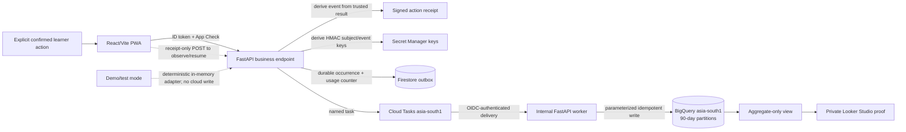

# Gate G7 — Pseudonymous Analytics, Deployment, and Cost Controls

Status: **APPROVED — Gate G7 approved 2026-08-28**  
Scope: the website/PWA checkpoint deployment. Approval unlocks SC-705; it does not create a Google Cloud project, enable billing, write production analytics, or deploy the application.

## Decision at a glance

SakhiCircle records only four successful, user-initiated checkpoint outcomes. The successful FastAPI business endpoint derives the event name and properties from trusted server state, mints an opaque signed action receipt, and creates a durable outbox occurrence containing an authenticated encrypted envelope of the allowlisted row. The browser can present only that receipt to the analytics endpoint to observe or resume delivery; it cannot choose an event name or outcome. FastAPI derives pseudonymous HMAC keys and idempotently writes the allowlisted row to BigQuery. Names, Firebase uids, emails, learner text, transcripts, hobby/goal values, accessibility choices, city, candidate identity, credentials, and audio never enter analytics.

Raw row-level events expire after 90 days. Looker Studio reads one aggregate-only view and is never granted access to row identifiers. Account deletion resolves every active HMAC-key version on the server and removes linkable rows within the existing G4 30-day target.

Cloud spend is bounded by scale-to-zero Cloud Run, a two-instance service limit, persistent application rate counters, a maximum of 20 Gemini journey workflows per `Asia/Kolkata` calendar day, BigQuery query limits, short retention, and alerts at USD 10, 25, and 40. Budget alerts are notifications, not spending caps; the runtime and query quotas are the preventive controls.



## Versioned event request

`POST /api/v1/analytics/events` is protected by the approved G4 Firebase ID-token and production App Check boundary. Models forbid unknown fields recursively. A successful business endpoint creates a server-owned UUIDv7 `eventId`, derives the exact event content from the trusted result, and returns `X-Sakhi-Analytics-Event-Id` plus `X-Sakhi-Analytics-Receipt`; CORS exposes only those two analytics response headers. The signed receipt binds the event ID, event name, allowlisted properties, issue/expiry times, a random nonce, and a nonce-scoped HMAC binding to the verified subject. It contains no uid or stable subject key and expires after 24 hours.

The business endpoint also creates the Firestore outbox occurrence and attempts to enqueue its deterministic Cloud Task before analytics emission is acknowledged. A failed product operation creates neither receipt nor outbox. An analytics enqueue failure never changes an already successful product response; the receipt lets the PWA retry the same occurrence, while a successfully enqueued task remains durable if the tab closes.

```json
{
  "schemaVersion": "analytics-v1.0.0",
  "eventId": "019c3c22-5a80-7b41-8aa4-9ce5f2f6e8d1",
  "actionReceipt": "v1.opaque-signed-receipt"
}
```

The endpoint verifies the receipt against the currently authenticated subject and either creates/resumes the same outbox occurrence or returns its current state. It returns `201` or `200` when the row is already written, and `202` when durable delivery is queued:

```json
{
  "schemaVersion": "analytics-v1.0.0",
  "eventId": "019c3c22-5a80-7b41-8aa4-9ce5f2f6e8d1",
  "status": "written",
  "duplicate": false
}
```

The authenticated subject plus server-owned `eventId` is the occurrence identity. A receipt/event mismatch returns `409 event_id_conflict`; it never overwrites the first row. A valid request is at most 2 KiB. The request cannot set event name/properties, uid, pseudonym, environment, timestamp, IP-derived location, user agent, device identifier, trace identifier, or dashboard dimensions.

## Exact event allowlist

Events are sent only after the named API operation succeeds. Page load, sign-in, text entry, voice capture, transcript editing, an unconfirmed profile, journey editing, language switching, rejected drafts, errors, and retries that have not produced a successful product result emit nothing.

| Event | Required successful trigger | Exact server-derived properties |
|---|---|---|
| `profile_confirmed` | `PUT /api/v1/profile` has saved the reviewed structured profile after explicit confirmation | None |
| `journey_draft_created` | `POST /api/v1/journeys` has returned a schema-valid editable draft after profile confirmation | `journeySchemaVersion`; `generator` = `deterministic_fixture`, `gemini_adk`, or `curated_fallback`; `fallbackUsed` boolean consistent with `generator` |
| `journey_confirmed` | `PUT /api/v1/journeys/{journeyId}` has persisted the learner-confirmed journey | The same three journey properties, derived from the confirmed document |
| `recommendation_presented` | The learner explicitly selected Find and `GET /api/v1/recommendations` returned a private `matched` or `no_matches` result | `matchingContractVersion`; `recommendationType` = `partner` or `mentor`; `outcome` = `matched` or `no_matches`; `resultCount` = 0–3 and consistent with `outcome` |

The server validates each property combination and supported contract version before signing the receipt. It adds fixed trusted values rather than accepting them from the browser: `eventTimestamp`, `eventDate`, `environment`, `subjectKey`, `subjectKeyVersion`, `eventKey`, and `payloadHash`.

No free-form property bag exists. A future event name, property, enum member, marketing tracker, crash-report body, session replay, advertising identifier, or third-party analytics SDK requires a new reviewed contract version and explicit approval.

## BigQuery row schema

The private `sakhi_analytics.checkpoint_events_v1` table is created in Mumbai (`asia-south1`) with this flattened schema. Required columns are non-null; event-specific columns are null unless their allowlist requires them. The authorized aggregate view lives in a second same-region dataset, `sakhi_reporting`; BigQuery and Looker principals with reporting access receive no permission on `sakhi_analytics`.

| Column | Type | Source and rule |
|---|---|---|
| `event_date` | `DATE` | `Asia/Kolkata` calendar date derived from the server timestamp; daily partition and reporting key |
| `event_timestamp` | `TIMESTAMP` | Server UTC receipt time; the client cannot backdate an event |
| `schema_version` | `STRING` | Exact `analytics-v1.0.0` |
| `event_name` | `STRING` | One of the four allowlisted names |
| `event_id` | `STRING` | Validated opaque UUIDv7 with a bounded embedded time; excluded from Looker |
| `event_key` | `STRING` | Server HMAC over subject key plus event ID; idempotency key; excluded from Looker |
| `payload_hash` | `STRING` | Server SHA-256 of canonical allowlisted content; conflict detection; excluded from Looker |
| `subject_key` | `STRING` | Versioned HMAC pseudonym derived from verified Firebase project and uid; excluded from Looker |
| `subject_key_version` | `STRING` | Fixed Secret Manager key version label used for deletion/rotation; excluded from Looker |
| `environment` | `STRING` | Always `production` in this dataset |
| `journey_schema_version` | `STRING` | Journey events only; currently `1.0.0` |
| `journey_generator` | `STRING` | Journey events only; fixed generator enum |
| `journey_fallback_used` | `BOOL` | Journey events only; consistent with generator |
| `matching_contract_version` | `STRING` | Recommendation event only; currently `matching-v1.0.0` |
| `recommendation_type` | `STRING` | Recommendation event only; `partner` or `mentor` |
| `recommendation_outcome` | `STRING` | Recommendation event only; `matched` or `no_matches` |
| `result_count` | `INT64` | Recommendation event only; 0–3 with outcome consistency |

The table explicitly excludes name, display name, Firebase uid, email, phone, transcript, raw or normalized learner text, hobby, goal, experience, availability, language preference, interface locale, accessibility choice, format, consent values, city or other location, journey ID or content, candidate ID/name, score/reasons, IP address, user agent, auth or App Check tokens, trace/log IDs, credentials, prompt/model output, raw audio, and payment data.

## Pseudonym, idempotency, and deletion

1. `subjectKey` is Base64URL HMAC-SHA-256 over `firebaseProjectId + ":" + verifiedUid`, using a dedicated Secret Manager key. A plain hash, Firebase uid, email, or client-supplied identity is never used.
2. `eventKey` is a separate HMAC over `subjectKey + ":" + eventId`. Key versions remain resolvable until every row created with them has expired or been deleted.
3. A Firestore outbox occurrence keyed by `eventKey` stores only the canonical payload hash, subject key/version, a keyed `deliveryHandleHash` lookup value, `sealedDeliveryPayload`, delivery state, lease timestamps, task name, attempt count, fixed failure code, and a seven-day TTL after terminal state. `sealedDeliveryPayload` is an AES-256-GCM authenticated-encryption envelope of the exact allowlisted BigQuery row. Its encryption key is derived with HKDF-SHA-256 from the versioned analytics secret under the separate `outbox-seal` domain; it uses a fresh 96-bit nonce and binds the schema version, event key, payload hash, and delivery-handle hash as associated data. The envelope is capped at 4 KiB, supports still-active key versions, and is cleared as soon as the occurrence reaches a terminal written, discarded, or failed state. Pending records do not expire before the Cloud Tasks retry window closes. A transaction permits one writer; identical retries resume/return the first outcome, while changed payloads conflict. Missing, oversized, or unauthentic sealed data writes no row and produces only fixed `sealed_payload_invalid` internal failure state.
4. Queue `analytics-delivery` runs in `asia-south1` at at most 2 dispatches/second and 2 concurrent dispatches. Its task name is a separate HMAC of `eventKey`, and its body contains only a random opaque delivery handle—never uid, subject/event key, event properties, sealed payload, or learner content. The worker derives `deliveryHandleHash` with a separate HMAC domain and uses that indexed value to resolve exactly one private outbox occurrence; the plaintext handle is never persisted. The task calls a non-public delivery route with an OIDC token from a dedicated task identity. It attempts at most 8 times over 24 hours with 10-second minimum and 15-minute maximum backoff. The runtime identity can enqueue only on this queue; the task identity can invoke only the delivery service.
5. The worker uses a parameterized BigQuery operation filtered to the 90-day partition window. A Firestore lease prevents concurrent same-event writes; a retry after an ambiguous BigQuery result checks `eventKey` and `payloadHash` before inserting. REST `insertAll` best-effort deduplication and Cloud Tasks' own finite task-name deduplication window are not accepted as proof of row uniqueness.
6. Tests use a deterministic local outbox/task adapter with the same uniqueness and retry rules and zero network or paid calls. Demo identities are rejected by the production adapter and never write production Firestore, Cloud Tasks, or BigQuery.

An account-deletion request derives every still-active `subjectKey` version before removing Firebase Authentication, creates a deletion fence using a separate non-joinable HMAC, cancels named delivery tasks where possible, deletes matching BigQuery rows and Firestore outbox/counter records, and records only a non-content-bearing retry state if a managed deletion job fails. Every delivery worker checks the fence immediately before its BigQuery operation; a fenced occurrence is acknowledged and discarded, so an in-flight retry cannot recreate deleted analytics. The fence contains no uid, subject/event key, or event property and expires after 97 days, covering the 90-day event window plus terminal outbox TTL. Success is not shown until the deletion job is acknowledged. The target remains within 30 days under G4; normal operation should complete sooner.

The BigQuery dataset uses the minimum two-day time-travel window. Google-managed deleted versions can then pass through BigQuery's fixed seven-day fail-safe period, but are not available to SakhiCircle or Looker during fail-safe and remain inside the 30-day G4 deletion target. No BigQuery export, backup table, copied dataset, or persisted aggregate table is created under this gate.

## Retention and dashboard boundary

| Data | Retention | Access boundary |
|---|---:|---|
| BigQuery row events | 90 days by partition expiry | Cloud Run analytics writer/deleter and a named administrator only |
| Firestore outbox occurrences | Encrypted payload only while pending through the bounded delivery window; sealed payload cleared at terminal state; remaining delivery metadata expires after 7 days; removed earlier on account deletion | Cloud Run runtime and dedicated task identities only |
| Non-joinable deletion fences | 97 days by TTL; no uid, analytics key, or event property | Analytics deletion and delivery adapters only |
| Persistent rate counters | Current and immediately previous daily/rolling windows only; TTL no later than 7 days | Cloud Run runtime identity only |
| Aggregate logical view | No independent storage; recalculated from retained rows | Dedicated Looker credential through the approved view only |
| Cloud Logging `_Default` | 30 days | Named project operators; application logs remain content-free under G4 |
| Cloud Logging `_Required` | Google-managed 400-day audit retention | Named project administrators; application payloads are never added |

`sakhi_reporting.checkpoint_metrics_v1` is an authorized aggregate view with a fixed 90-day partition predicate over `sakhi_analytics.checkpoint_events_v1`. It exposes only the `Asia/Kolkata` calendar date plus counts and rates for:

1. confirmed profiles;
2. journey drafts created per confirmed profile;
3. journeys confirmed per journey draft;
4. recommendations presented per confirmed journey, split only by `matched` versus `no_matches`.

The view never exposes event, subject, journey, or recommendation identifiers; timestamps finer than a date; source/generator; locale; recommendation type; or any learner/candidate field. Looker Studio uses Owner's Credentials belonging to a dedicated least-privilege report account, can query only this authorized view, has no automatic refresh, and is shared only with named reviewers. The report and data source are not public or link-accessible.

## Deployment and IAM boundary

SC-705 may provision only the explicitly approved checkpoint project and services. It must show the proposed project ID, billing account, owners, and commands before any resource-creating command is run.

| Resource | Locked boundary |
|---|---|
| Region | Cloud Run, Firestore, both BigQuery datasets, Cloud Tasks, and any event-processing resource use Mumbai `asia-south1`; Firebase Hosting remains global |
| Cloud Run ingress | The HTTPS service is reachable by the PWA; `/health` and `/ready` are public, while every `/api/v1/*` route enforces Firebase Authentication and production App Check |
| Runtime identity | A dedicated service account gets only Secret Manager access to named runtime secrets, Firestore access required by approved adapters/counters, enqueue access on `analytics-delivery`, BigQuery job creation, and write/delete access to the private analytics dataset |
| Task identity | A dedicated identity can invoke only the internal analytics-delivery route; the route rejects Firebase/browser credentials and any task with the wrong OIDC audience/issuer |
| Deployment identity | Separate from runtime; can deploy Hosting/Run and impersonate the runtime account, but cannot read runtime secret values or learner data by default |
| Looker identity | BigQuery job user plus read access to the aggregate authorized view only; no raw table or Firestore access |
| Secrets/config | Gemini key, HMAC key material, and service credentials stay in Secret Manager/runtime config; actual project IDs use uncommitted local configuration, never committed secrets |

Production configuration fails closed if the expected project, app ID, App Check, private/reporting datasets, analytics table/view, Cloud Tasks queue/identity, HMAC secret version, rate-counter store, or adapter binding is missing. It never switches to demo credentials, deterministic production data, an unprotected endpoint, or a different region.

## Preventive quotas and cost controls

### Runtime controls

| Control | Approved value | Failure behavior |
|---|---:|---|
| Cloud Run service instances | minimum `0`, maximum `2` | Queue briefly, then fail with a retryable response when capacity is exhausted; Cloud Run can briefly exceed a configured maximum during a traffic spike, so application quotas remain authoritative |
| Container size | 1 vCPU, 512 MiB memory | Deployment fails rather than silently selecting a larger shape |
| Container concurrency | `20` | Excess traffic waits/fails within the platform boundary |
| Cloud Run request timeout | `30s` | Request ends without extending a provider call; the approved G5 workflow remains 10 seconds per attempt and at most two attempts |
| General protected API limit | 60 accepted requests per subject per rolling minute | `429` with `Retry-After`; no protected work starts |
| Analytics limit | 20 new event IDs per subject per day; 500 per project day | Identical retries do not consume a new unit; excess returns `429` before Firestore/BigQuery write |
| Recommendation limit | 20 requests per subject per day; 500 per project day | `429`; confirmed journey remains available |
| Gemini journey limit | 3 workflows per subject per rolling 24 hours; 20 per project day | Persistent counter is reserved before provider work; excess or unavailable counter returns `429` and makes zero model calls |

Every application "day" in the analytics and recommendation limits and the Gemini project limit is one `Asia/Kolkata` calendar date derived from server UTC time. Subject minute and 24-hour limits are rolling windows. BigQuery's provider-managed custom query quota remains separate and resets at midnight Pacific Time.

The Gemini cap includes failed workflow attempts. With G5's maximum of two attempts and three model stages per attempt, the project ceiling is 120 model calls per India calendar day. Counters use server time and Firestore transactions; production refuses the cost-bearing call when the counter store is missing or unavailable. Automated tests, deterministic mode, and demo mode make zero paid calls.

### Operational cost-control state

SC-706 implements one deny-by-default server adapter and operator script for Firestore document `ops_config/cost_controls_v1`:

```json
{
  "schemaVersion": "cost-controls-v1.0.0",
  "geminiProjectDailyAllowance": 20,
  "maintenanceMode": false,
  "updatedAt": "server timestamp"
}
```

`geminiProjectDailyAllowance` is an integer from `0` through the immutable deployment maximum `20`; the runtime can never raise it above that maximum. Only the named operator/deployment identity can update the document, using a script that prints the active project and requested change and requires explicit confirmation. Firebase client rules deny all reads/writes. The Cloud Run runtime uses a read-only adapter for this document and a cache no older than 60 seconds.

If the document is missing, invalid, or unreadable, new paid Gemini work is denied while non-paid product routes remain available. `maintenanceMode: true` keeps `/health` public, makes `/ready` report maintenance, and returns a fixed retryable `503 maintenance_mode` from `/api/v1/*` before protected work or paid calls begin. Local deterministic mode ignores the production document and remains usable.

### BigQuery and storage controls

| Control | Approved value |
|---|---:|
| Billing model | On-demand only; no slot reservation, BI Engine reservation, or capacity commitment |
| Project query quota | `QueryUsagePerDay = 0.01 TiB` |
| Per-user/service-account query quota | `QueryUsagePerUserPerDay = 0.005 TiB` |
| Backend query job limit | `maximumBytesBilled = 20 MiB` plus dry-run evidence for maintained dashboard/deletion queries |
| Table layout | Daily `event_date` partitions, `requirePartitionFilter = true`, clustered by `event_name` then `subject_key` |
| Row retention | 90-day partition expiry; dataset time travel reduced from seven days to two days |
| Dashboard | One aggregate view and one manually refreshed Looker Studio page; no extracts, scheduled query, or public data source |

BigQuery custom quotas are additional safeguards and can be approximate. Queries fail closed when the per-job or daily limit is reached; the product journey remains usable because analytics failure is reported internally and never rolls back an already successful learner action.

### Budget alerts and response

One monthly USD 40 project budget uses actual-spend thresholds of 25%, 62.5%, and 100%, producing the required alerts at USD 10, 25, and 40. A forecasted 100% alert is also enabled. Notifications go to the project owner/billing administrators and a dedicated Pub/Sub topic retained only for cost-alert routing.

| Alert | Operator action |
|---|---|
| USD 10 | Review Cloud Billing by service and verify Cloud Run, Gemini, BigQuery, logging, and storage usage against this contract |
| USD 25 | Run the confirmed operator script to set `geminiProjectDailyAllowance` to `0`; journey generation returns the fixed quota response without a model call, while the rest of the judged flow and deterministic local evidence remain available |
| USD 40 | Run the confirmed operator script to set `maintenanceMode` to `true`, preserve `/health`, stop optional dashboard queries, and investigate before re-enabling traffic |

Budget notifications do not automatically detach billing or delete resources. Artifact Registry keeps the three newest deployable images and deletes older untagged images after 14 days. Cloud Tasks is approved only for the bounded `analytics-delivery` queue above; SC-705 does not enable a VPC connector, Cloud NAT, load balancer, Cloud Armor, always-on worker, BigQuery reservation, data export, scheduled backup, or unrelated API without a new approved need.

## Failure behavior

| Condition | Contract |
|---|---|
| Missing/invalid authentication | `401`; no event, token, or identity detail |
| Missing/invalid production App Check | `403`; no event |
| Demo/synthetic identity targets production analytics | `403 analytics_production_only`; local deterministic evidence remains available |
| Missing/invalid/expired action receipt or subject binding | `422 invalid_analytics_receipt`; no outbox change or row |
| Receipt event ID differs from request | `409 event_id_conflict`; first occurrence remains unchanged |
| Same occurrence and identical payload | `200`, `status: written`, `duplicate: true`; row count remains one |
| Same occurrence with changed payload | `409 event_id_conflict`; first row remains unchanged |
| Rate or cost quota reached | `429` with fixed code and `Retry-After`; no paid/downstream call starts |
| Outbox/queue/BigQuery configuration missing in production | `503 analytics_configuration_required`; never falls back to demo or another project |
| Durable task queued but row not written yet | `202`, `status: queued`; the task retries within its bounded policy |
| Analytics enqueue unavailable after a product success | The completed learner action remains successful; the signed receipt may be retried for 24 hours, and the UI does not blame the learner or claim the product action failed |
| Missing, oversized, or unauthentic sealed outbox payload | No BigQuery write; terminal fixed `sealed_payload_invalid` state; no ciphertext, key, event, or subject detail is logged |

API logs contain only trace ID, route template, status, latency, fixed error code, and aggregate integration-call counters. They never contain request/response bodies, event IDs/keys, subject keys, headers/tokens, provider payloads, or any G4-forbidden field.

## Verification unlocked after approval

SC-705 must prove the project/region binding, Firebase Auth/App Check configuration, both BigQuery datasets and authorized-view boundary, least-privilege IAM, the bounded Cloud Tasks queue, BigQuery quotas, retention settings, Secret Manager references, Artifact Registry policy, and USD 10/25/40 alerts without deploying product traffic. It validates the declarative Cloud Run configuration but does not claim live runtime settings before SC-720 deploys a service revision.

SC-706 must add red tests before implementing the persistent subject/project counters, India calendar boundaries, immutable deployment maximum, read-only runtime adapter, confirmed operator script, `0` Gemini allowance, maintenance behavior, missing/invalid control-state failure, and proof that a denied workflow makes zero model calls.

SC-710 must add red tests before implementation for server-derived action receipts for all four events; recursive receipt/request rejection; every forbidden identifier/content field; server-owned timestamps/keys; subject binding; HMAC rotation and deletion lookup; identical retry versus changed-payload conflict; concurrent and ambiguous-write idempotency; authenticated sealed-payload round trip and tamper rejection; keyed opaque-handle lookup without plaintext handle persistence; durable opaque-task enqueue and retry exhaustion; outbox TTL and terminal payload clearing; task-route OIDC rejection; deletion-fence prevention of an in-flight post-deletion write; demo isolation; production fail-closed configuration; two-dataset authorized-view column exclusion; retention/partition settings; and zero paid/network calls in deterministic tests.

Configured integration evidence must show an unsigned or client-forged outcome produces no occurrence, two identical signed receipt requests produce one BigQuery row, a task survives client closure and one transient worker failure, the reporting identity can query the aggregate view but not the raw dataset, the checkpoint query stays inside its byte limit, and a deletion fixture removes every linkable row. Complete web, browser, build, and backend suites still run before SC-710 is presented for approval.

SC-720 must prove the deployed Cloud Run service uses minimum `0`, maximum `2`, 1 vCPU, 512 MiB memory, concurrency `20`, timeout `30s`, the named runtime identity, and the verified maintenance behavior before receiving live product traffic.

## Current-platform references

- Google Cloud documents Mumbai as BigQuery region `asia-south1`: [BigQuery locations](https://cloud.google.com/bigquery/docs/locations).
- BigQuery authorized views use a separate view dataset while granting no direct source-table access to reporting users: [authorized views](https://cloud.google.com/bigquery/docs/authorized-views).
- Partition expiration and required filters provide the retention/query-scan controls: [manage partitioned tables](https://cloud.google.com/bigquery/docs/managing-partitioned-tables) and [query partitioned tables](https://cloud.google.com/bigquery/docs/querying-partitioned-tables).
- BigQuery time travel can be reduced to two days; the following seven-day fail-safe is fixed: [time travel and fail-safe](https://cloud.google.com/bigquery/docs/time-travel).
- Per-job maximum bytes and daily custom quotas are supported safeguards, though daily custom quotas are approximate: [estimate and control costs](https://cloud.google.com/bigquery/docs/best-practices-costs) and [custom query quotas](https://cloud.google.com/bigquery/docs/custom-quotas).
- Cloud Run warns that a configured maximum can be exceeded briefly, which is why server quotas remain required: [maximum instances](https://cloud.google.com/run/docs/configuring/max-instances).
- Google Cloud explicitly states that alerts-only budgets do not cap spending: [budgets and alerts](https://cloud.google.com/billing/docs/how-to/budgets).
- Cloud Tasks supports bounded queue rates/retries and OIDC-authenticated HTTP delivery: [configure queues](https://cloud.google.com/tasks/docs/configuring-queues) and [HTTP target tasks](https://cloud.google.com/tasks/docs/creating-http-target-tasks).
- Looker Studio Owner's Credentials use the credential owner's underlying data access: [data credentials](https://cloud.google.com/looker/docs/studio/data-credentials-article).

## Approval record

The user approved Gate G7 as revised on 2026-08-28 and approved the `sealedDeliveryPayload` durability correction on 2026-09-02. SC-700 and SC-705 are `DONE`; SC-710 implementation remains separately test-first and approval-gated. These approvals do not themselves authorize product deployment, a secret value, a Cloud Task, a BigQuery query or mutation, a Looker report change, or any resource outside this contract.
